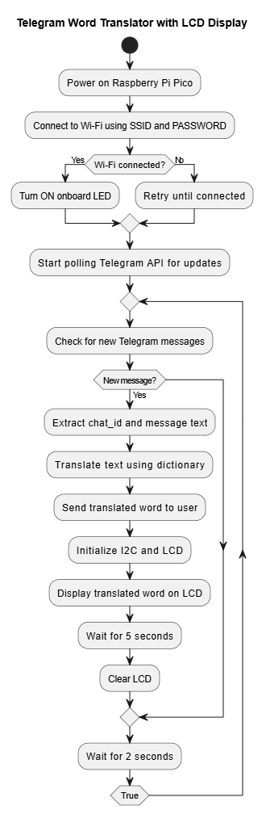

# Telegram Word Translator with LCD Display (MicroPython + Raspberry Pi Pico)

This project allows users to send English words to a Telegram bot. The bot responds with the **French translation** of the word and displays it on a **20x4 I2C LCD** connected to a Raspberry Pi Pico. It’s a fun and simple way to combine **IoT + Telegram Bot + MicroPython**!

---

## Flowchart

Here's how the system works, step-by-step:

---

##  Telegram Bot Output

This is what it looks like when a word is sent to the bot and the translation is received:

---

## 🔧 Hardware Requirements

- Raspberry Pi Pico (or Pico W for Wi-Fi)
- I2C 20x4 LCD display (Address: `0x27`)
- Connecting wires
- Breadboard (optional)
- USB cable
- Internet access

---

## 📡 Features

- Connects to Wi-Fi using MicroPython
- Integrates with Telegram Bot API
- Translates English → French (using dictionary)
- Displays result on LCD via I2C
- Sends reply to user via Telegram
- Onboard LED lights up after Wi-Fi connection

---

## ⚙️ Setup Instructions

1. Flash MicroPython firmware on your Raspberry Pi Pico w.
2. Connect LCD to the correct GPIO pins (SDA → GP0, SCL → GP1).
3. Upload the following files to the Pico:
   - `main.py` (your script)
   - `lcd_api.py` and `pico_i2c_lcd.py`(external libraries)
4. Create a bot using [@BotFather]and get the bot token.
5. Replace the SSID, password, and bot token in the code.
6. Run the script and start messaging your bot!

---

## Example Inputs

Send any of these messages to the bot:

hello
goodbye
cat
school
love

And receive translations like:

Bonjour
Au revoir
chat
école
aimer

##  Future Ideas

- Add real-time translation using Google Translate API
- Add speech-to-text input using microphone module
- Add OLED or touchscreen display support
